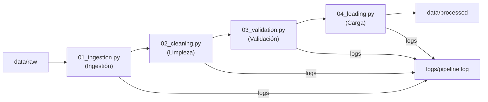

# Fraud Detection - Pipeline DataOps

Evaluación Parcial 2 - Gestión de Datos para IA (Duoc UC)

Este repositorio contiene un pipeline automatizado para la detección de fraude en transacciones con tarjeta de crédito. Se aplica una metodología híbrida (PMBOK + Agile) con énfasis en prácticas DataOps.

## Tecnologías principales

- Python 3.10
- Docker (imagen base: python:3.10-slim)
- Procesamiento: pandas, numpy
- Validación: Great Expectations, pydantic
- Modelado: XGBoost, scikit-learn
- Despliegue: Streamlit, joblib
- Logging: módulo estándar `logging`
- Gestión del proyecto: Trello y GitHub

## Arquitectura del pipeline

El flujo principal del pipeline está representado a continuación en Mermaid (flujo de alto nivel):



> Ver [Carta Gantt completa](docs/GANTT.md) con las 14 tareas WBS y cronograma del proyecto.

## Estructura del repositorio

```text
.
├── data/
│   ├── raw/           # Dataset original (ignorado en git)
│   └── processed/     # Datos limpios y enmascarados (ignorado en git)
├── src/
│   ├── logger_config.py   # Logging centralizado (timestamp, severidad, pipeline.log)
│   ├── 01_ingestion.py
│   ├── 02_cleaning.py
│   ├── 03_validation.py
│   └── 04_loading.py
│   └── 05_model_training.py
├── models/             # Modelos entrenados (.joblib ignorado en git)
├── app.py              # Interfaz web Streamlit
├── logs/              # Registros del pipeline (ignorado en git)
├── docs/              # Informe técnico y recursos PMBOK
│   └── GANTT.md        # Carta Gantt con las 14 tareas WBS
├── Dockerfile
├── requirements.txt
└── .gitignore
```

## Cómo ejecutar (local / Docker)

1. Construir la imagen Docker:

```bash
docker build -t fraud-detection .
```

2. Ejecutar la etapa de ingestión:

```bash
docker run --rm \
  -v $(pwd)/data:/app/data \
  -v $(pwd)/logs:/app/logs \
  fraud-detection python src/01_ingestion.py
```

3. Ejecutar la etapa de limpieza y enmascaramiento:

```bash
docker run --rm \
  -v $(pwd)/data:/app/data \
  -v $(pwd)/logs:/app/logs \
  fraud-detection python src/02_cleaning.py
```

4. Ejecutar la etapa de validación:

```bash
docker run --rm \
  -v $(pwd)/data:/app/data \
  -v $(pwd)/logs:/app/logs \
  fraud-detection python src/03_validation.py
```

5. Ejecutar la etapa de carga final:

```bash
docker run --rm \
  -v $(pwd)/data:/app/data \
  -v $(pwd)/logs:/app/logs \
  fraud-detection python src/04_loading.py
```

6. Entrenar el modelo XGBoost:

```bash
docker run --rm \
  -v $(pwd)/data:/app/data \
  -v $(pwd)/logs:/app/logs \
  -v $(pwd)/models:/app/models \
  fraud-detection python src/05_model_training.py
```

7. Ejecutar la interfaz Streamlit:

```bash
streamlit run app.py
```

## Modelo (XGBoost)

- **Algoritmo**: XGBoost Classifier con `scale_pos_weight` para manejar desbalance de clases
- **Split**: cronologico (80/20) sobre `trans_date_trans_time` (previene data leakage)
- **Metricas**: Recall + F1-Score (Accuracy invalido en datasets desbalanceados)
- **Exportacion**: `models/xgboost_fraud_model.joblib`

## Dataset (resumen)

- Filas: 555,719 transacciones
- Columnas (23): trans_date_trans_time, cc_num, merchant, category, amt, first, last, gender, street, city, state, zip, lat, long, city_pop, job, dob, trans_num, unix_time, merch_lat, merch_long, is_fraud
- Variable objetivo: `is_fraud` (0 = legítima, 1 = fraude)

## Privacidad y cumplimiento

- El proyecto aplica la Ley N° 19.628 de Protección de Datos Personales (Chile).
- Columnas consideradas PII: `cc_num`, `first`, `last`, `street`.
- Estrategia: hashing y enmascaramiento antes de persistir o compartir los datos procesados.


