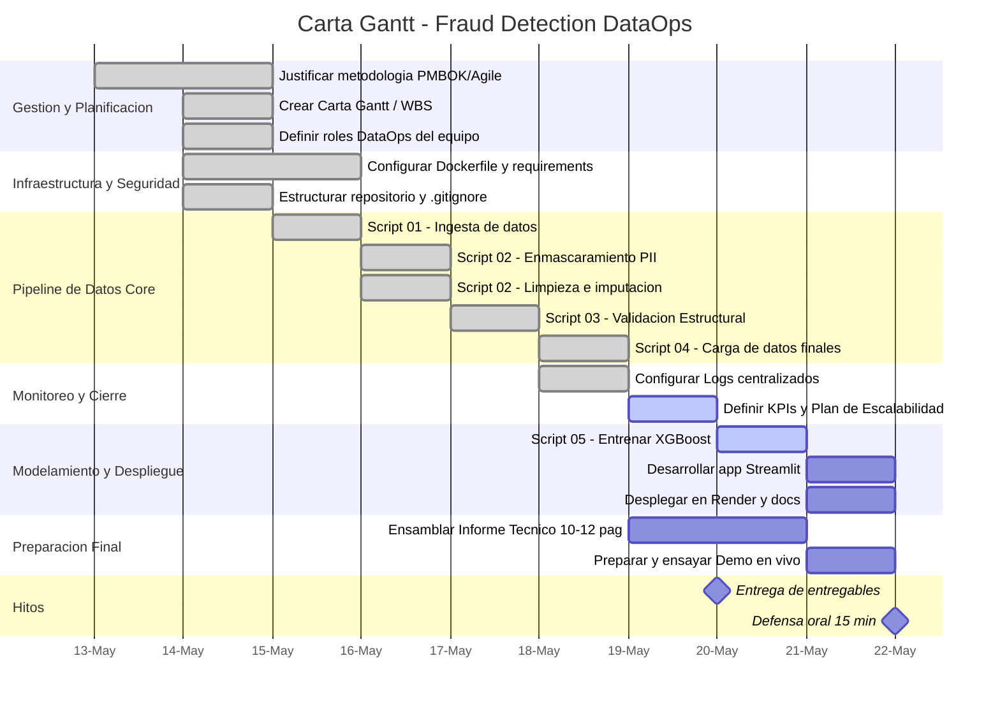

## Carta Gantt (PMBOK/WBS)

Cronograma del proyecto con metodologia hibrida PMBOK/Agile (17 tareas atomicas WBS).

## Hitos clave

| Fecha | Hito |
|-------|------|
| 2026-05-13 | Inicio del proyecto |
| 2026-05-20 | Entrega de entregables (informe + codigo + Docker + modelo) |
| 2026-05-22 | Defensa oral (15 min, 3 integrantes) |
